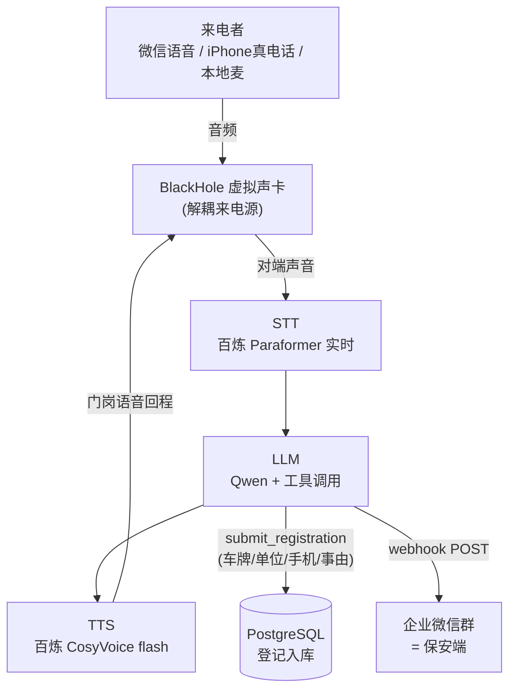

# 园区访客语音登记 Agent

语音门卫：来电者打进来，在自然对话中采集 **车牌号 / 来访单位 / 手机号 / 来访事由**，
把结构化登记推送到企业微信群（代表保安端）。**目标：从接通到推送 < 25 秒**，体验像真人门岗。
全栈国产（阿里云百炼）、实时音频不出境、开源。

## 架构



> 管线由 Pipecat 编排（`LocalAudioTransport` + Silero VAD/打断）；STT→LLM→TTS 串成一路，TTS 经虚拟声卡回传给来电者。

- **关键设计**：开场白一句批量问全；车牌/手机号在最后一次复述里念出供纠正；公司名走租户名单模糊匹配（"金鱼"→"鲸鱼科技"）；四字段齐即提交、写库 + 推企微 + 优雅挂断。每轮 STT/LLM/TTS 延迟与"接通→推送"总耗时都打结构化日志。
- **25s 达标说明（诚实口径）**：**本地/清晰音频路径实测 ~18–21s，达标 <25s**（demo 走这条）。微信语音/真电话经 8k 窄带通道，ASR 误识增多、输入碎片化 + 网络往返延迟，**实际会超过 25s**——这是消费级来电源（无电信信令、窄带）的固有限制，非管线处理慢（每轮延迟见日志，很快）；生产换正规电信 SDK（宽带 + 接通信令）可消除，见 [SELECTION.md](SELECTION.md)。
- 三层语音/LLM 共用同一把 `DASHSCOPE_API_KEY`，国内直连。来电源经虚拟声卡解耦，一套管线吃多种来电方式。

## 部署

**前置**：macOS、[uv](https://docs.astral.sh/uv/)、Docker Desktop（须先启动守护进程）。
来电源(微信/电话)额外需要：[BlackHole](https://github.com/ExistentialAudio/BlackHole) **2ch + 16ch**（`brew install --cask blackhole-2ch blackhole-16ch`）、`brew install switchaudio-osx`。

```bash
uv sync                       # 装依赖
cp .env.example .env          # 填 DASHSCOPE_API_KEY 与 WECOM_WEBHOOK_URL
docker compose up -d          # 起 PostgreSQL

# —— 跑（每通登记完自动重启等下一通，Ctrl+C 退出）——
./scripts/start-local.sh      # 本地麦克风（戴耳机防回声）
./scripts/start.sh            # 微信语音 / iPhone 真电话（经 BlackHole）
```

> **来电源音频路由**：需在「音频 MIDI 设置」把 **BlackHole 2ch 名义率设为 16000Hz**（否则 48k 被电话 8k 读端坏转换→音质损坏），并把通话设备和这台 Mac 解除 Apple 关联（防 Continuity 串音）。完整说明见 [PROGRESS.md](PROGRESS.md)「阶段4 音质坑」。真 PSTN 接入为生产项，本仓库用微信语音 / iPhone Continuity 演示，详见 [SELECTION.md](SELECTION.md)。

## 环境变量

| 变量 | 必填 | 说明 |
|---|---|---|
| `DASHSCOPE_API_KEY` | ✅ | 阿里云百炼 key（STT/TTS/LLM 共用） |
| `WECOM_WEBHOOK_URL` | ✅ | 企业微信群机器人 webhook |
| `LLM_MODEL` | | Qwen 模型，默认 `qwen-plus` |
| `STT_MODEL` / `STT_SAMPLE_RATE` | | `paraformer-realtime-v2` / `16000` |
| `TTS_MODEL` / `TTS_VOICE` / `TTS_SAMPLE_RATE` | | `cosyvoice-v3-flash` / `longxiaochun_v3` / `16000` |
| `TTS_SPEECH_RATE` | | 对话语速，默认 `1.25` |
| `AUDIO_INPUT_DEVICE` / `AUDIO_OUTPUT_DEVICE` | | 留空=本机麦；电话填 BlackHole 设备名（脚本会代设） |
| `GREET_ON_FIRST_SOUND` | | 电话 `true`（来电者首声再问候）/ 本地 `false`（启动即问候） |
| `TURN_STOP_SECS` | | 轮次结束静音等待秒数，默认 `0.8` |
| `POSTGRES_*` | | 库连接，与 `docker-compose.yml` 对齐 |

完整含注释见 [.env.example](.env.example)。密钥永不进仓库。

## 技术栈与文档

编排 Pipecat（自托管，内置 VAD/打断）｜STT 百炼 Paraformer｜LLM Qwen（OpenAI 兼容端点）｜
TTS 百炼 CosyVoice flash｜音频入口 本地音频 + 虚拟声卡｜数据库 本地 PostgreSQL｜推送 企微 webhook｜后端 FastAPI。

选型与 trade-off → [SELECTION.md](SELECTION.md)｜分阶段构建 → [PROJECT.md](PROJECT.md)｜进度与踩坑复盘 → [PROGRESS.md](PROGRESS.md)。
